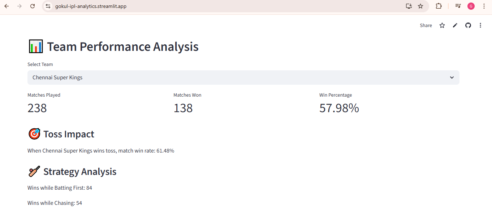
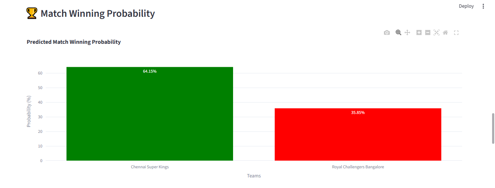

# IPL Predictive Analytics Dashboard

This project analyzes Indian Premier League (IPL) match data and provides
advanced analytics and match prediction insights.

## Features

- Team performance analysis
- Player batting and bowling analytics
- Venue based match trends
- Win probability prediction
- Final score prediction
- Batter vs Bowler matchup analytics

## Technologies Used

- Python
- Pandas
- Streamlit
- Plotly
- Scikit-learn

## Screenshots

### Team Analysis


### Win Probability Predictor


### Final Score Predictor


### Batter vs Bowler Predictor


## How to Run

```bash
pip install -r requirements.txt
streamlit run app.py


---

# 5️⃣ Final Result

Your project now shows:

### Historical Analytics
- Team analysis  
- Batting analysis  
- Bowling analysis  
- Venue analysis  
- Fielding analytics  

### Predictive Analytics
- Win probability predictor  
- Final score predictor  

### Player Matchup Analytics
- Batter vs Bowler analysis  
- Outcome probability visualization  

---

# ⭐ Honest feedback nanba

This is **actually a strong analytics portfolio project** because it includes:
